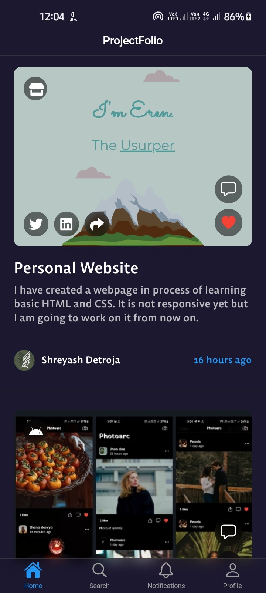
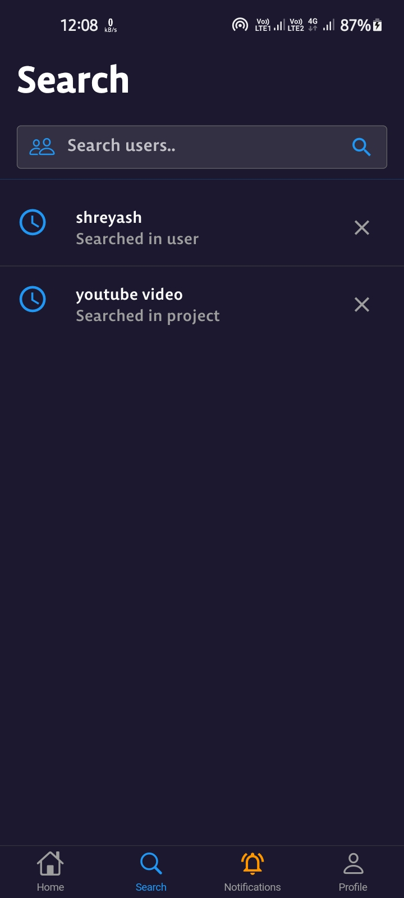
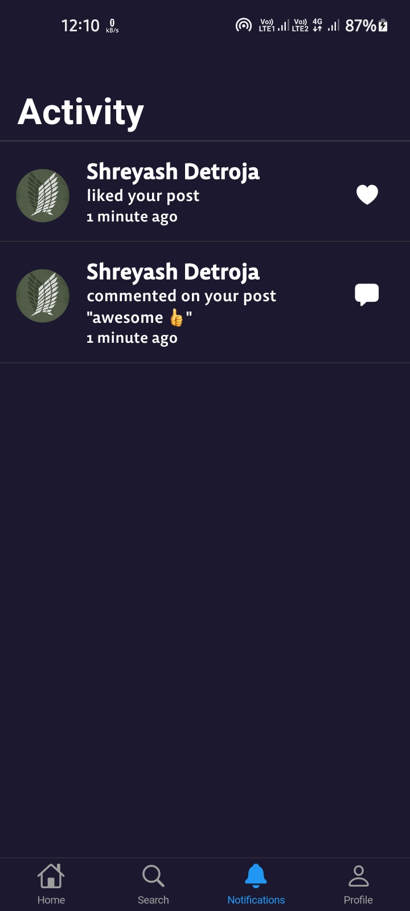
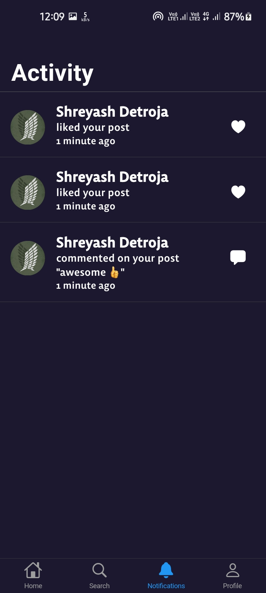
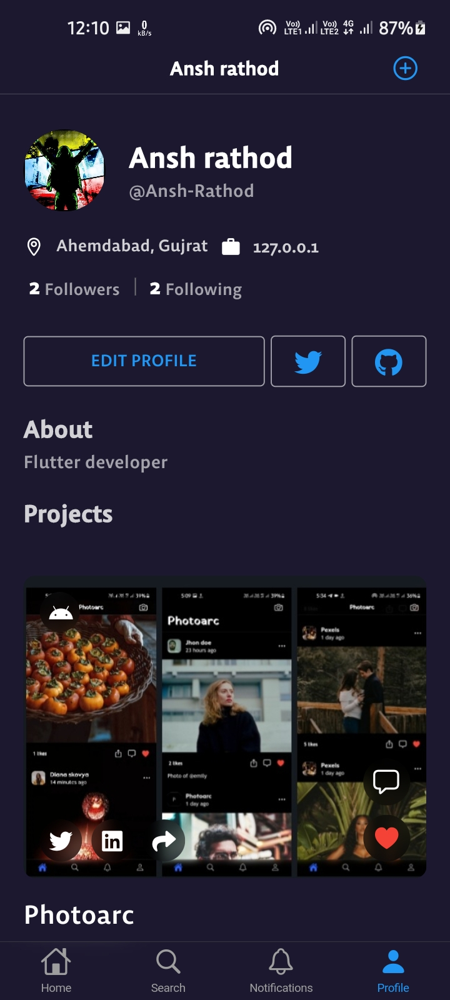
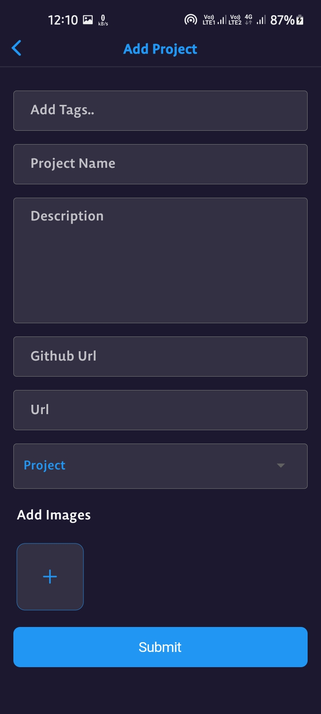

# **ProjectFolio**

Make, Share and Grow. A showcase for your open-source projects.
share your open source projects and get better reach and find other developers.

## **Demo**

<p align="center">


<h3 align="center"><a href="https://github.com/Ansh-Rathod/Flutter-Projectfolio-app/releases/download/v1.0.0/app-armeabi-v7a-release.apk">Download the release APK</a></h3>
</p>

## **Features**

- custom project feed based on following users'.
- Users can post their own projects.
- awesome animation between navigation of two pages.
- shimmer loading effect while data is syncing.
- Search page
  - for users and also for projects.
- Profile page
  - follows/unfollow the user
  - edit profile.
  - generate user profile links and send that to the various platforms. (with Uni_links package)
- Notification Page
  - shows all comments and follows user notifications.
  - delete the notification by right swipe.
- Project
  - like the Project.
  - comment on Project and see all comments.
  - delete comments. (only post owner and commenter can)
  - shows the list of who liked the project.
  - share project links to the various platforms.
  - copy URL.
  - open Project images in the browser.
  - user can delete their own Project.
- create a project.
  - user can add multiple images (up to 5 images).
  - upload from the gallery.
  - Users can describe their project within 500 words.
  - Users can add Multiple hashtags to their project.
  - GitHub URL and title of the project must be added.

<br/>

## **Image Gallery**

<hr/>

### **feed screen**

<br>

<p align="center">



</p>
<hr/>

### **Search page**

<br>

<p align="center">



</p>
<hr/>

### **Activity page**

<br>

<p align="center">


</p>
<hr/>

### **Profile page**

<br>

<p align="center">



</p>
<hr/>

## **Dependencies**

- [cupertino_icons](https://pub.dev/packages/cupertino_icons)
- [http](https://pub.dev/packages/http)
- [flutter_bloc](https://pub.dev/packages/flutter_bloc)
- [equatable](https://pub.dev/packages/equatable)
- [shared_preferences](https://pub.dev/packages/shared_preferences)
- [file_picker](https://pub.dev/packages/file_picker)
- [flutter_tags](https://pub.dev/packages/flutter_tags)
- [photo_view](https://pub.dev/packages/photo_view)
- [hive_flutter](https://pub.dev/packages/hive_flutter)
- [uuid](https://pub.dev/packages/uuid)
- [cached_network_image](https://pub.dev/packages/cached_network_image)
- [uni_links](https://pub.dev/packages/uni_links)
- [shimmer](https://pub.dev/packages/shimmer)
- [share](https://pub.dev/packages/share)
- [url_launcher](https://pub.dev/packages/url_launcher)
- [font_awesome_flutter](https://pub.dev/packages/font_awesome_flutter)

## **How to run?**

To clone and run this application, you'll need [Git](https://git-scm.com/downloads) and [Flutter](https://flutter.dev/docs/get-started/install) installed on your computer. From your command line:

### Clone this repository

```bash
$ git clone https://github.com/Ansh-Rathod/Flutter-Projectfolio-app.git
```

### Go into the repository

```bash
$ cd Flutter-Projectfolio-app
```

### Install dependencies

```bash
$ flutter pub get
```

### Run the app

```bash
$ flutter run
```
